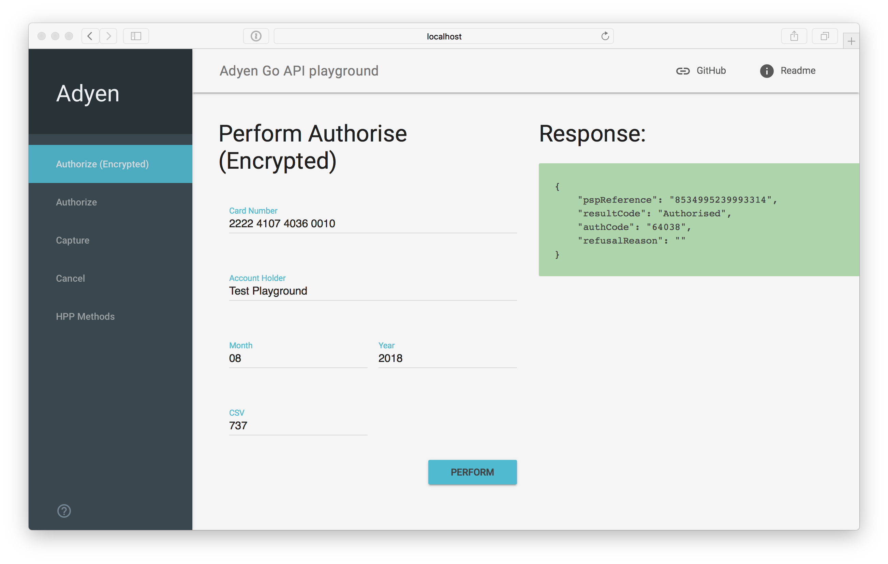

# [WIP] Adyen API for Go Example Playgroup

## Install

```
go get github.com/zhutik/adyen-api-go
```



## Configuration

### Expose your settings for Adyen API configuration.

```server.go``` script will use those variables to communicate with API

```
$ export ADYEN_CLIENT_TOKEN="YOUR_ADYEN_CLIENT_TOKEN"
$ export ADYEN_USERNAME="YOUR_ADYEN_API_USERNAME"
$ export ADYEN_PASSWORD="YOUR_API_PASSWORD"
$ export ADYEN_ACCOUNT="YOUR_MERCHANT_ACCOUNT"
```

Or, modify ```.default.env.template```

```
cp .default.env.template .default.env

# modify/change .default.env and put your credentials

source .default.env
```

Settings explanation:
* ADYEN_CLIENT_TOKEN - Library token in Adyen, used to load external JS file from Adyen to validate Credit Card information
* ADYEN_USERNAME - Adyen API username, usually starts with ws@
* ADYEN_PASSWORD - Adyen API password for username
* ADYEN_ACCOUNT - Selected Merchant Account

## Run with Docker-compose

Note: Expose your configuration (as shown above)

```
$ docker-composer up

# or 

$ docker-composdr up -d
```

Open ```http://localhost:8080``` in your browser


## Run example without Docker

```
# Install dependencies
$ go get -d -v ./...
$ go install -v ./...

$ go run main.go
```

### Perform payments

Open ```http://localhost:8080``` in your browser
Put credit card information.

Test credit cards could be found https://docs.adyen.com/support/integration#testcardnumbers

## Contribute

Please check initial library repository https://github.com/zhutik/adyen-api-go
